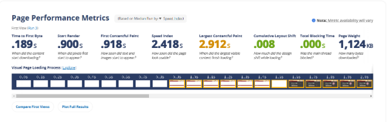
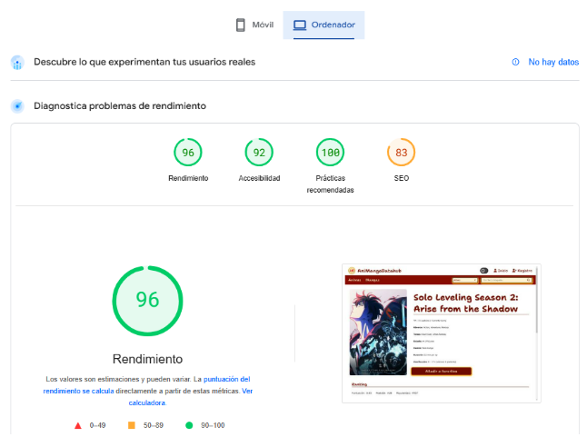

**Ángel Manuel Pereira Rodríguez**

# Índice

1. Evaluación inicial de estándares y navegación
2. Pruebas de usabilidad y velocidad con herramientas automáticas
   1. WebPageTest
   2. PageSpeed Insights
   3. Lighthouse
   4. Ghost Inspector
3. Reflexiones finales

# Evaluación inicial de estándares y navegación

En el proyecto AniMangaDatahub se aplica correctamente los estándares de utilizar HTML, CSS y JavaScript válidos; debido a que se están empleando HTML5, CSS3, SASS y JavaScript con el ECMAScript 6. Sin embargo, a la hora del estándar de elementos gráficos sí que se utilizan correctamente los SVGs pero no se están empleando PNGs en todas las imágenes ya que en la mayoría de casos se utilizan JPGs o WEBPs.

La navegación en la web se puede realizar cómodamente mediante ratón, queda un poco con menor claridad al utilizar la pantalla táctil y pierde algunas de las interacciones al navegar con el teclado (por ejemplo al perder la posibilidad de ampliar el desplegable que se encuentra en el header de la web).

El uso de estándares web es importante debido a que permite al usuario poder interactuar cómodamente con la web bajo cualquier circunstancia y a su vez, permite que la experiencia de usuario sea más agradable. Por otra parte, estos estándares ayudan a los programadores y diseñadores a realizar productos más eficientes.

# Pruebas de usabilidad y velocidad con herramientas automatizadas

## WebPageTest

Podemos ver que la pantalla home en escritorio no tiene una mala rapidez pero necesita mejoras de usabilidad y seguridad.  
Página home Chrome  

Página home Firefox  

La página de listado podemos ver que no tiene una mala velocidad de carga pero necesita mejoras de usabilidad y seguridad en escritorio; sin embargo, necesita una mejora en la velocidad de carga del elemento más grande y en el tiempo de bloqueo en el móvil. Esto sucede de igual manera en la página del producto.  
Página de listado escritorio  
  

Página de listado móvil  

Página de producto escritorio  

Página de producto móvil  
  

## PageSpeed Insights

En la página home en móvil podemos ver un rendimiento por debajo de lo recomendable.  

Sin embargo, en escritorio podemos ver que tiene un buen rendimiento.  

La página de listado tiene unos rendimientos parecidos a los de la página home  

Al igual que en la página de listado, la página de producto tiene un rendimiento bastante similar tanto en móvil como en escritorio.  

Las principales mejoras a realizar están enfocadas sobre todo en las imágenes, teniendo que ajustar los widths y heights, usar formatos de nueva generación, codificarlas de forma eficaz y precargar la imagen de renderizado del mayor elemento con contenido. También hay que reducir el CSS y JavaScript que no se utiliza, minificar los recursos JavaScript y eliminar los recursos que bloqueen el renderizado.

## Lighthouse

En formato de móvil estas son las métricas que se reciben. Podemos comprobar que mayormente suele tener un rendimiento mediocre tirando a malo.

Sin embargo, en formato de escritorio vemos que las métricas mejoran bastante.

Para mejorar estos resultados habría que hacer lo siguiente:

- FCP: Utilizar tamaños apropiados de las imágenes, codificar adecuadamente las imágenes, minificar y reducir el JavaScript y reducir el JavaScript y CSS sin usar.
- LCP: Mejorar la carga del elemento más grande, utilizar formatos de imágenes de última generación y realizar los mismos cambios que con FCP.
- TBT: Minimizar el trabajo del hilo principal, mejorando el tiempo que se emplea en parsear, compilar y ejecutar JavaScript.
- CLS: Evitar cambios bruscos en el diseño y especificar el width y el height en las imágenes.

## Ghost Inspector

Ver el vídeo [test-ghost-inspector.mp4](https://github.com/AngelPereiraR/Testing-en-producci-n/blob/main/test-ghost-inspector.mp4).

Como se puede comprobar en el vídeo, el test automatizado permite realizar un login de forma correcta, además de navegar a lo largo de la página web.

# Reflexiones finales

Podemos concluir que la usabilidad de esta página web necesita mejoras importantes respecto a la optimización del código y de las imágenes para que la sensación de uso de los usuarios sea más fluida y rápida, sin embargo, ya introduce algunas cosas adecuadas como es el uso de estándares web y en ciertos formatos cumple con varias de las métricas mínimas que debería cumplir.
